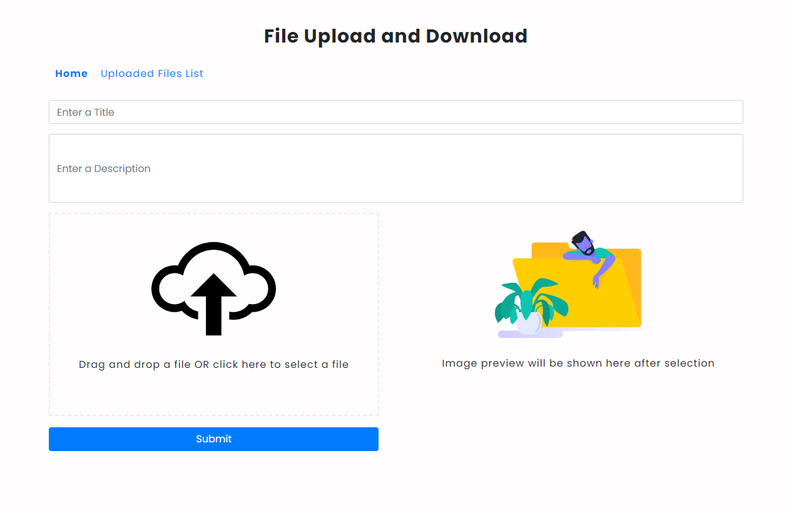

To run this application, add your MongoDB connection details in `server/db/db.js` file.

Open another terminal and execute the following commands in sequence from inside the project folder

```js
1. cd server
2. npm install
3. npm start
4. cd ..
5. cd frontend
6. npm install
7. npm start
```

and access the application at http://localhost:3000/
